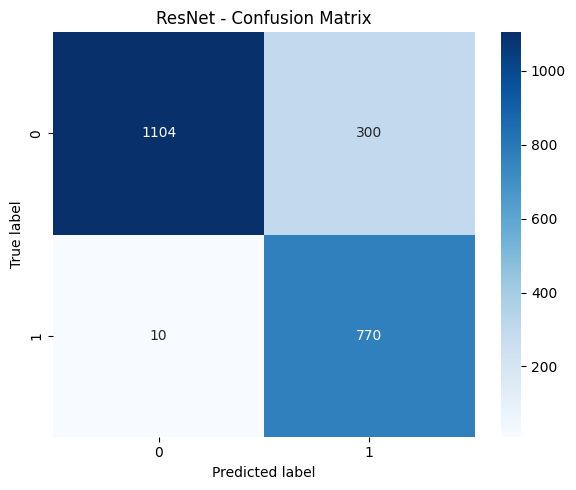

# XRay Pneumonia Detector

A Deep Learning project to detect pneumonia from chest X-ray images (Accuracy = 86%)

---

## Table of Contents
- [What is Pneumonia?](#what-is-pneumonia)
- [Why Detecting Pneumonia with Deep Learning is Important](#why-detecting-pneumonia-with-deep-learning-is-important)
- [What I Did in This Project](#what-i-did-in-this-project)
- [Technologies](#technologies)
- [Results](#results)
- [Contributor](#contributor)

---

## What is Pneumonia?
Pneumonia is an infection that inflames the air sacs in one or both lungs, which may fill with fluid. It can cause cough, fever, and difficulty breathing, and is particularly dangerous for children and the elderly.

---

## Why Detecting Pneumonia with Deep Learning is Important
Rapid and accurate detection of pneumonia is crucial to save lives. Deep Learning models can analyze chest X-ray images at scale and assist doctors in identifying the disease more quickly and reliably.

---

## What I Did in This Project
1. **Data Visualization**: Explored X-ray images and class distribution using Matplotlib.  
2. **ML Tracking with MLflow**: Tracked experiments, hyperparameters, and model performance.  
3. **Handled Data Imbalance**: Applied calculated data augmentation to balance classes.  
4. **Fine-Tuned CNNs**: Fine-tuned pre-trained models (ResNet50, VGG16, EfficientNet, MobileNet) using PyTorch.  
5. **K-Fold Cross Validation**: Ensured model robustness through cross-validation.  
6. **Model Evaluation and Comparative Analysis**: Used metrics such as accuracy, precision, recall, F1-score, ROC curve, and confusion matrix.  
7. **Saved the Best Performing Model**: The fine-tuned ResNet50 is saved for inference.  
8. **Streamlit Interface**: Created a simple interface where users can upload an X-ray image and see the prediction with confidence scores.

---

## Technologies
- Python 
- PyTorch  
- Streamlit  
- MLflow  
- Matplotlib, Seaborn  
- NumPy, Pandas  
- OpenCV

---

## Results

---

## Contributor
- Abderrahmane Guerinik

---

## License
This project is licensed under the MIT License.
